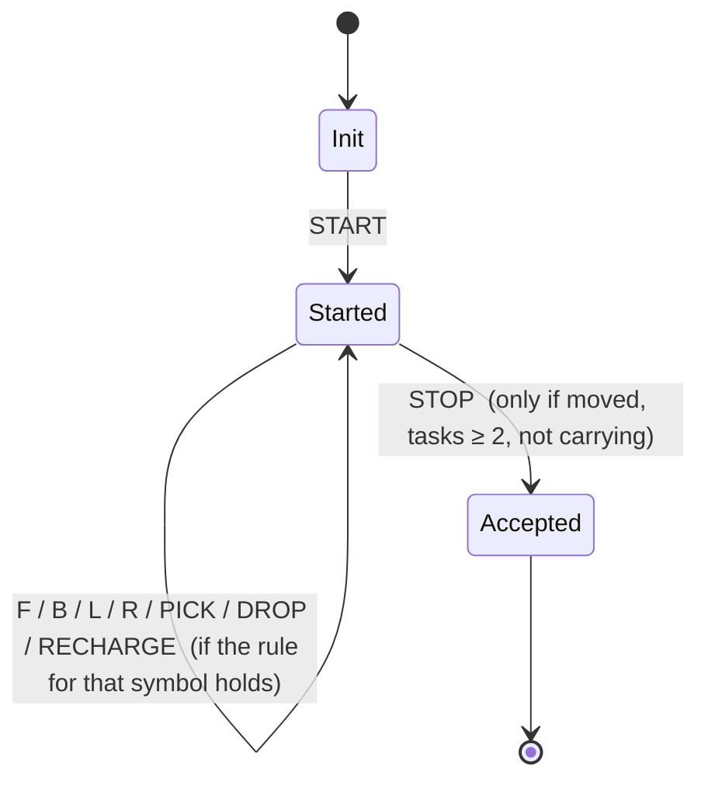

# Robot Navigation Using Finite Automata
### Project Documentation

| Field | Value |
|-------|-------|
| Project | Robot Navigation Simulator (8×8 grid) |
| Course | Automata Theory / Formal Languages |
| Author | Brusmuny Pum |
| Type | Web application (HTML + CSS + vanilla JavaScript) |
| Status | Complete |

> Fill in your course code, instructor name, and submission date in the table above before handing in.

---

## 1. Introduction

This project is a **visual robot navigation simulator** built around a **finite automaton (DFA)**.
A user writes — or clicks — a sequence of commands that drive a robot on an 8×8 grid. Before the
robot runs, every command sequence is checked against a fixed set of language rules. Only sequences
that the automaton **accepts** are allowed to execute.

The core idea of the assignment is that the legal command sequences form a **formal language**, and a
finite automaton is the natural machine to decide membership in that language. The simulator makes the
automaton visible: you can *see* the robot move, *see* which commands are legal at each step, and *see*
exactly why an illegal sequence is rejected.

---

## 2. Objectives

1. Define a **command alphabet** for controlling a robot.
2. Define the **rules** (the language) that a valid command sequence must obey.
3. Design a **finite automaton** that decides whether a sequence is valid.
4. Implement the automaton in code and integrate it with a **visual simulation**.
5. Let the user interact in two ways: by **typing** a full sequence, or by **driving the robot
   manually** one command at a time.

---

## 3. The Command Language

### 3.1 Alphabet (Σ)

| Symbol | Meaning |
|--------|---------|
| `START` | Begin the sequence (must be first) |
| `STOP` | End the sequence (must be last) |
| `F` | Move one cell forward |
| `B` | Move one cell backward |
| `L` | Turn left 90° |
| `R` | Turn right 90° |
| `PICK` | Pick up an object on the current cell |
| `DROP` | Drop the carried object |
| `RECHARGE` | Reset energy to full |

### 3.2 The World

- The grid is **8 × 8**. Coordinates run from `(0,0)` to `(7,7)`. `(0,0)` is the bottom-left cell.
- The robot starts at **`(0,0)` facing North**, with **energy 3 / 3** and carrying nothing.
- **Objects** are placed on specific cells (default: `(2,1)` and `(4,2)`). A `PICK` only succeeds
  when the robot is standing on an object cell; the object is then consumed.

### 3.3 Directions and movement

Directions cycle `N → E → S → W` (right turn `R` advances the cycle, left turn `L` reverses it).
Forward movement deltas:

| Facing | `F` moves | `B` moves |
|--------|-----------|-----------|
| N | `(x, y+1)` | `(x, y-1)` |
| E | `(x+1, y)` | `(x-1, y)` |
| S | `(x, y-1)` | `(x, y+1)` |
| W | `(x-1, y)` | `(x+1, y)` |

A move is rejected if it would leave the grid.

---

## 4. The Rules (the language definition)

The validated rule set, with the assignment's overwrites applied:

| # | Rule | Notes |
|---|------|-------|
| 1 | The sequence must **start with `START`** and **end with `STOP`**. | |
| 2 | The robot must perform **at least one movement** (`F` or `B`). | |
| 3 | **`PICK` before `DROP`**; cannot `PICK` twice without a `DROP`; cannot finish while carrying. | |
| 4 | *(superseded by Rule 8)* | At least one pick–drop → replaced by two |
| 5 | *(superseded by Rule 10)* | No more than 2 consecutive turns → replaced |
| 6 | **Movement needs energy**; `F`/`B` cost 1 energy; **`RECHARGE` resets energy to full**. | Turns do not cost energy |
| 8 | The robot must complete **at least two `PICK`–`DROP` tasks**. | Overwrites Rule 4 |
| 10 | The robot **cannot turn twice in a row** (any two adjacent turns: `LL`, `RR`, `LR`, `RL`). | Overwrites Rule 5 |
| 14 | At every point, **\|left turns − right turns\| ≤ 2**. | |

**Additional world constraints** (added by the object feature, consistent with the rules above):
- A `PICK` is only valid on a cell that currently holds an object.
- The robot must stay inside the 8×8 grid.
- Because each object is consumed by one `PICK` and Rule 8 needs two tasks, **at least two objects**
  must exist for a sequence to be completable.

### Note on Rule 10
"Cannot turn left or right twice in a row" is implemented in the **strict** sense: *any* two adjacent
turns are illegal, not only same-direction repeats. This is the reading that cleanly "overwrites"
Rule 5 (which counted consecutive turns) and produces the simplest automaton.

---

## 5. Automaton Design

### 5.1 Why this is a (large) DFA

Although the code tracks several quantities, **each one ranges over a finite set**, so the machine is
a genuine deterministic finite automaton — its full state is the product of these finite components:

| Component | Finite range |
|-----------|--------------|
| Energy | `{0, 1, 2, 3}` |
| Completed tasks | `{0, 1, ≥2}` |
| Carrying | `{yes, no}` |
| Last turn | `{none, L, R}` |
| Turn balance (L − R) | `{-2, -1, 0, 1, 2}` (bounded by Rule 14) |
| Position | one of 64 cells |
| Direction | `{N, E, S, W}` |
| Phase | `{init, started, stopped}` |
| Objects remaining | a subset of the object cells |

Instead of literally enumerating millions of states, the implementation stores these components as
**variables** and computes each transition from them. This is the standard, compact way to implement a
large DFA.

### 5.2 High-level phases



Every transition out of `Started` is **guarded** by the relevant rule. If the guard fails, the command
is **rejected**: the state does not change and an error explains why.

### 5.3 Rule → transition guard

| Symbol | Guard checked before applying |
|--------|-------------------------------|
| `START` | only legal as the very first symbol (phase = init) |
| `F` / `B` | energy > 0 **and** the target cell is inside the grid |
| `L` / `R` | previous symbol was not a turn (Rule 10) **and** \|L − R\| would stay ≤ 2 (Rule 14) |
| `PICK` | not already carrying **and** an object is on the current cell |
| `DROP` | currently carrying |
| `RECHARGE` | always legal (sets energy to full) |
| `STOP` | has moved (Rule 2) **and** tasks ≥ 2 (Rule 8) **and** not carrying (Rule 3) |

---

## 6. System Architecture

```
.
├── index.html          Page layout, command box, object box, control pad, grid, status
├── css/style.css       All styling, grid, robot/object markers, animations
└── js/
    ├── constants.js    Shared constants (energy, grid size, alphabet, default objects)
    ├── movement.js     Direction maths, movement deltas, grid-bounds check
    ├── automaton.js    Batch validator — checks a whole typed sequence (collects all errors)
    ├── live.js         Live automaton — validates one command at a time (drives the robot)
    ├── renderer.js     Renders grid, robot, objects, status, timeline, log, messages
    └── main.js         Wires buttons, input, validation, auto-run, manual drive together
```

### Module responsibilities

- **`constants.js`** — `MAX_ENERGY = 3`, `GRID_SIZE = 8`, the command alphabet, `DEFAULT_OBJECTS`,
  and the `DIRECTIONS` cycle.
- **`movement.js`** — pure helpers: forward/backward deltas, left/right turning, direction names,
  and the 8×8 bounds test. No state.
- **`automaton.js`** — `validateCommands(commands)` walks the entire sequence and returns
  `{ valid, errors, trace }`. It **collects every error** so the user sees all problems at once.
- **`live.js`** — `createLiveState()` and `applyLiveCommand(state, command)` apply **one** command
  with full rule checking. `allowedCommands(state)` returns the set of commands that are legal right
  now (used to enable/disable the control-pad buttons). State updates are **immutable** (a rejected
  command never mutates the state).
- **`renderer.js`** — turns state into DOM: the grid cells, the robot marker, object/delivered icons,
  the status dashboard, the command timeline, the execution log, and validation messages.
- **`main.js`** — the controller: reads the inputs, runs validation, performs auto-run, and handles
  manual driving and reset.

---

## 7. Validation: two engines, one language

The project validates in **two complementary ways**:

1. **Batch validation (`automaton.js`)** — used by the **Validate** and **Auto-Run** buttons on a
   typed sequence. It reports *all* rule violations together and enforces `START`-first / `STOP`-last.

2. **Live validation (`live.js`)** — used by the **manual control pad** and as a second pass during
   Validate/Auto-Run (`validateWorldActions`). It replays the sequence command-by-command and is the
   one that also checks **object placement** (PICK must be on an object cell). It stops at the first
   violation.

Both engines implement the same rules 1–14; the live engine adds the world checks. Together they make
sure a sequence is legal both as an abstract string *and* as a physically possible robot run.

---

## 8. Key Features

### 8.1 Manual drive (live automaton)
A control pad lets the user click `START`, `F`, `B`, `L`, `R`, `PICK`, `DROP`, `RECHARGE`, `STOP`.
Each click feeds **one** command to the live automaton:
- If legal → the robot moves, energy/tasks update, the command is appended to a live sequence strip.
- If illegal → the robot does not move and a message explains exactly why.

**Smart buttons:** only the commands that are legal *right now* are enabled. On load only `START` is
clickable; after `START` the pad opens up to the legal moves; after any turn both turn buttons disable
(Rule 10); `STOP` enables only once the run can legally finish. This makes the automaton's current
state directly visible.

### 8.2 Object pickup
Objects are configurable in the **Pickup Objects** box (e.g. `2,1 4,2`). The robot can only `PICK`
while standing on an object; picked objects are consumed, and delivery cells are marked. Because two
tasks are required (Rule 8), at least two objects are needed.

### 8.3 Visual grid
- A box icon marks a pickup object (amber); a check-circle marks a delivered cell (green).
- The robot marker shows its facing direction (`^ > v <`).
- Visited cells are tinted; a status dashboard shows position, direction, energy, carrying, tasks.
- A timeline highlights the active step during auto-run; an execution log records every action.

---

## 9. Worked Example

Default objects: `(2,1)` and `(4,2)`. Default sequence:

```
START R F L F R RECHARGE F L PICK DROP F R F RECHARGE F L PICK DROP F L STOP
```

Abbreviated trace (position, facing, energy):

| Step | Cmd | Result |
|------|-----|--------|
| 1 | START | (0,0) N, e=3 |
| 2 | R | face E |
| 3 | F | (1,0), e=2 |
| 4 | L | face N |
| 5 | F | (1,1), e=1 |
| 6 | R | face E |
| 7 | RECHARGE | e=3 |
| 8 | F | (2,1), e=2 — on object |
| 9 | L | face N |
| 10 | PICK | object collected at (2,1) ✓ |
| 11 | DROP | task 1 complete |
| 12 | F | (2,2), e=1 |
| 13 | R | face E |
| 14 | F | (3,2), e=0 |
| 15 | RECHARGE | e=3 |
| 16 | F | (4,2), e=2 — on object |
| 17 | L | face N |
| 18 | PICK | object collected at (4,2) ✓ |
| 19 | DROP | task 2 complete |
| 20 | F | (4,3), e=1 |
| 21 | L | face W |
| 22 | STOP | accepted ✓ (moved, 2 tasks, not carrying) |

Checks satisfied: starts/ends correctly (1); many moves (2); each PICK before its DROP, no double pick
(3); 2 tasks (8); no two turns adjacent (10); turn balance stays within ±2 (14); energy never used at
0, recharged before running out (6).

---

## 10. How to Run

1. Open `index.html` in any modern browser. No build step or installation is needed.
2. **Manual mode:** click `START`, then click commands on the control pad to drive the robot.
3. **Typed mode:** edit the command box, click **Validate** to check, then **Auto-Run** to play it.
4. **Reset** returns the robot to `(0,0)`.
5. Optionally edit the **Pickup Objects** box to place objects on different cells (use `x,y`).

---

## 11. Testing & Verification

The pure engine modules were exercised with the following representative cases, all behaving correctly:

- The default sequence is **accepted** and delivers both objects.
- Rule violations are each **rejected** with a clear message: missing `START`/`STOP`, no movement,
  `DROP` before `PICK`, double `PICK`, finishing while carrying, only one task, two turns in a row,
  turn balance exceeding ±2, and a move with no energy.
- `PICK` off an object cell is rejected; the control pad enables `PICK` only when on an object.

---

## 12. Assumptions & Limitations

- **Rule 10** is strict (no two adjacent turns of any kind) — see §4.
- **Turns do not consume energy** (no turn-energy rule was assigned); only `F`/`B` cost energy.
- **`RECHARGE`** may be used at any time and always sets energy to full.
- At least **two objects** must be configured, otherwise Rule 8 can never be satisfied.
- The automaton checks legality; it does not search for or optimise a path.

---

## 13. Possible Future Work

- Consolidate the two validators so the live engine is the single source of truth.
- Show the live DFA state (energy, tasks, turn-balance) as a small panel during manual drive.
- Add path-finding to auto-generate a valid sequence for given objects.
- Export the run (sequence + trace) as a report.

---

## 14. Appendix — Rule → Code Map

| Rule | `automaton.js` | `live.js` |
|------|----------------|-----------|
| 1 (START/STOP) | `validateStartAndStop` | START guard at top |
| 2 (movement) | `validateFinalState` (`hasMoved`) | STOP guard |
| 3 (pick/drop) | PICK/DROP blocks + final carrying check | PICK/DROP blocks + STOP carrying |
| 6 (energy) | F/B energy + RECHARGE | F/B energy + RECHARGE |
| 8 (two tasks) | `validateFinalState` (`completedTasks < 2`) | STOP guard |
| 10 (no two turns) | `lastTurn !== null` | `lastTurn !== null` |
| 14 (\|L−R\| ≤ 2) | `Math.abs(left-right) > 2` | `Math.abs(left-right) > 2` |
| World: PICK on object | — | object-cell check in PICK |
